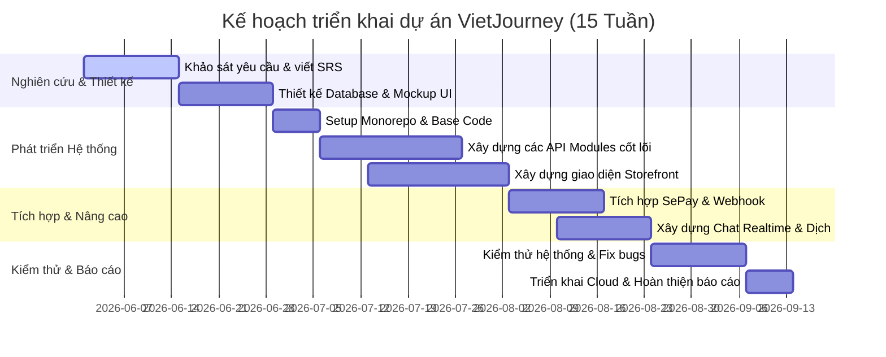

# TÀI LIỆU ĐẶC TẢ YÊU CẦU PHẦN MỀM (SRS)
## ĐỒ ÁN LIÊN NGÀNH
### DỰ ÁN: XÂY DỰNG WEBSITE ĐẶT HOMESTAY KẾT HỢP DU LỊCH TRẢI NGHIỆM BẢN ĐỊA (VIETJOURNEY / MOODTRAVEL)

---

# 1. GIỚI THIỆU

## 1.1 Đặt vấn đề
Trong những năm gần đây, xu hướng du lịch của du khách trong và ngoài nước đang có sự dịch chuyển mạnh mẽ. Thay vì lựa chọn các tour du lịch nghỉ dưỡng truyền thống tại các khách sạn 5 sao hay khu resort khép kín, du khách—đặc biệt là thế hệ trẻ—ngày càng ưa chuộng các hình thức du lịch trải nghiệm, khám phá văn hóa bản địa và hòa mình vào cuộc sống của người dân địa phương. Loại hình lưu trú homestay kết hợp với các hoạt động trải nghiệm thực tế (như làm nông nghiệp, nấu ăn món bản địa, trekking cùng người địa phương, dệt vải, làm gốm...) trở thành một thị trường đầy tiềm năng.

Tuy nhiên, thị trường du lịch trải nghiệm bản địa tại Việt Nam hiện đang đối mặt với nhiều hạn chế:
1. **Thiếu kênh kết nối chuyên nghiệp:** Các chủ homestay ở vùng sâu, vùng xa, vùng đồng bào dân tộc thiểu số sở hữu nguồn tài nguyên văn hóa phong phú nhưng thiếu kỹ năng công nghệ để tiếp cận khách hàng. Họ chủ yếu quảng cáo qua các hội nhóm mạng xã hội (Facebook, Zalo) với độ tin cậy thấp, luồng thông tin rời rạc và không có quy trình đặt chỗ tự động.
2. **Sự manh mún của các dịch vụ trải nghiệm:** Du khách thường phải đặt phòng lưu trú ở một nơi và tự tìm kiếm các tour trải nghiệm ở nơi khác qua các kênh không chính thống. Việc thiếu một nền tảng tích hợp cả hai dịch vụ khiến việc lên kế hoạch chuyến đi trở nên phức tạp và rủi ro.
3. **Rào cản ngôn ngữ:** Khi du khách quốc tế muốn trải nghiệm văn hóa bản địa, việc giao tiếp với các chủ homestay bản xứ (vốn ít giao tiếp bằng tiếng Anh) là một thách thức lớn trong quá trình đặt phòng và trao đổi dịch vụ.
4. **Quy trình thanh toán phức tạp:** Các phương thức thanh toán trực tuyến hiện tại trên các nền tảng quốc tế (như Airbnb, Booking.com) thường tính phí hoa hồng rất cao (từ 12% - 20%) và thủ tục nhận tiền đối với các chủ nhà bản địa ở Việt Nam phức tạp, thời gian đối soát lâu.

Do đó, việc xây dựng một hệ thống website **VietJourney / MoodTravel** chuyên biệt để đặt homestay kết hợp với du lịch trải nghiệm bản địa, hỗ trợ công nghệ dịch thuật thời gian thực và thanh toán tự động nội địa là vô cùng cần thiết, giải quyết triệt để các nỗi đau của cả du khách lẫn các hộ kinh doanh địa phương.

## 1.2 Các giải pháp đã có
Hiện nay, trên thị trường có một số giải pháp lưu trú và du lịch trực tuyến lớn hoạt động, bao gồm:
*   **Airbnb:** Nền tảng đặt phòng homestay lớn nhất thế giới, có phân hệ "Experiences" (Trải nghiệm). Tuy nhiên, phí dịch vụ đối với cả chủ nhà và khách hàng tương đối cao. Airbnb cũng không tối ưu hóa các trải nghiệm mang tính đặc trưng, sâu sắc của từng bản làng Việt Nam và giao diện chat chưa hỗ trợ dịch thuật tự động đa ngôn ngữ tích hợp trực quan.
*   **Booking.com / Agoda:** Tập trung mạnh vào khách sạn truyền thống, căn hộ dịch vụ cao cấp. Các sản phẩm homestay mang tính bản địa khó cạnh tranh hiển thị trên các nền tảng này. Ngoài ra, họ không bán kèm các tour trải nghiệm địa phương tự phát của người dân bản làng.
*   **Klook / Traveloka:** Tập trung vào vé vui chơi giải trí và các tour du lịch quy mô lớn, được tổ chức bởi các công ty lữ hành chuyên nghiệp, thiếu đi tính mộc mạc và trải nghiệm tương tác trực tiếp với người dân địa phương.
*   **Các hội nhóm mạng xã hội (Facebook, TikTok):** Nơi giao dịch tự phát của khách du lịch và chủ homestay. Kênh này thiếu tính pháp lý, dễ xảy ra lừa đảo, không giữ phòng đảm bảo và không có hệ thống quản lý lịch trống, quản lý doanh thu chuyên nghiệp.

## 1.3 Giải pháp đề xuất
Dự án **VietJourney / MoodTravel** đề xuất xây dựng một nền tảng thương mại điện tử du lịch tích hợp, tập trung vào hai trụ cột chính: **Lưu trú Homestay bản địa** và **Tour trải nghiệm thực tế cùng người dân địa phương**.

Các điểm cải tiến đột phá của giải pháp đề xuất bao gồm:
1.  **Mô hình Monorepo hiệu năng cao:** Sử dụng **Next.js (React 19)** cho Frontend mang lại trải nghiệm mượt mà, tối ưu SEO vượt trội nhờ Server-Side Rendering (SSR), kết hợp với **NestJS (Node.js)** ở Backend cung cấp hệ thống API mạnh mẽ, dễ dàng bảo trì và mở rộng.
2.  **Tích hợp bản đồ trực quan (Leaflet Maps):** Giúp du khách dễ dàng tìm kiếm homestay theo tọa độ địa lý, trực quan hóa vị trí của homestay giữa các vùng núi, bản làng xa xôi mà các Google Maps truyền thống đôi khi chưa cập nhật chi tiết.
3.  **Hệ thống thanh toán tự động VietQR (SePay - MBBank):** Cho phép khách hàng thanh toán chuyển khoản ngân hàng không tiền mặt cực kỳ nhanh chóng bằng cách quét mã QR động. Hệ thống backend tự động xử lý khớp nội dung qua Webhook để xác nhận đơn đặt phòng tức thì mà không cần sự can thiệp thủ công của con người, tiết kiệm chi phí giao dịch tối đa cho chủ nhà.
4.  **Kênh giao tiếp thời gian thực (WebSocket - Socket.io) tích hợp dịch thuật tự động (Google Translate API):** Xóa bỏ rào cản ngôn ngữ giữa khách ngoại quốc và chủ nhà người địa phương. Tin nhắn gửi đi sẽ được dịch tức thời sang ngôn ngữ cấu hình yêu thích của người nhận.
5.  **Phân hệ quản lý chuyên nghiệp cho Chủ nhà (Owner Dashboard):** Cung cấp công cụ quản lý lịch trống phòng/tour linh hoạt, biểu đồ thống kê doanh thu trực quan, giúp những người nông dân làm du lịch dễ dàng quản lý dòng tiền và vận hành kinh doanh.

---

# 2. THIẾT KẾ VÀ TRIỂN KHAI

## 2.1 Các yêu cầu chức năng

Hệ thống được thiết kế với 3 phân hệ chức năng tương ứng với 3 vai trò (Roles) trong cơ sở dữ liệu:

### 2.1.1 Phân hệ Khách hàng (User - USER)
*   **Đăng ký/Đăng nhập:** Đăng ký tài khoản thường (xác thực qua email bằng SendGrid/Resend) hoặc đăng nhập nhanh thông qua bên thứ ba (Google OAuth 2.0, Facebook OAuth).
*   **Quản lý hồ sơ cá nhân:** Cập nhật thông tin liên hệ, số điện thoại, ảnh đại diện, đổi mật khẩu và lựa chọn ngôn ngữ ưu tiên hiển thị.
*   **Tìm kiếm & Lọc:**
    *   Tìm kiếm homestay theo thành phố/vùng miền, ngày nhận/trả phòng, số lượng khách du lịch.
    *   Lọc homestay theo loại hình (Homestay, Villa, Resort, Hotel), mức giá, điểm đánh giá và danh sách tiện nghi (Wifi, điều hòa, bếp nấu, xe máy miễn phí...).
    *   Tìm kiếm tour du lịch bản địa theo loại hình (Trekking, Resort, Văn hóa, Du thuyền) và vùng miền (Bắc, Trung, Nam).
*   **Xem thông tin chi tiết:**
    *   Chi tiết homestay: Bộ sưu tập ảnh (lightbox), mô tả chi tiết, chính sách nhận/trả phòng, danh sách phòng trống kèm giá cụ thể cho từng phòng, đánh giá của các khách hàng trước, bản đồ vị trí địa lý (Leaflet Map).
    *   Chi tiết tour: Lịch trình chi tiết từng ngày (itinerary), dịch vụ bao gồm/không bao gồm, ngày khởi hành và số lượng chỗ còn trống.
*   **Đặt phòng & Đặt tour:**
    *   Chọn phòng và số lượng cụ thể, nhập thông tin người lưu trú/tham gia.
    *   Áp dụng mã giảm giá (coupon) để khấu trừ hóa đơn.
    *   Lưu đơn đặt ở trạng thái chờ thanh toán (`PENDING`).
*   **Thanh toán VietQR:** Quét mã QR thanh toán động hiển thị trên màn hình với số tiền và nội dung chuyển khoản được cấu trúc sẵn. Hệ thống tự động chuyển sang trang thành công khi nhận được webhook xác nhận chuyển khoản từ SePay.
*   **Tương tác & Cộng đồng:**
    *   Đánh giá (Review): Chấm điểm sao (1-5) và viết nhận xét kèm hình ảnh thực tế sau khi hoàn thành kỳ nghỉ/tour.
    *   Danh sách yêu thích (Wishlist): Lưu lại các homestay hoặc tour yêu thích để xem lại sau.
    *   Nhắn tin trực tuyến (Real-time Chat): Chat trực tiếp với chủ homestay/tour. Tin nhắn tự động được dịch sang ngôn ngữ đích tương ứng với tùy chọn của đối phương.
*   **Xem bài viết (Blog):** Xem các bài viết chia sẻ kinh nghiệm du lịch, cẩm nang văn hóa bản địa do Admin hoặc Owner biên soạn.

### 2.1.2 Phân hệ Chủ nhà (Host/Owner - OWNER)
*   **Đăng ký tài khoản doanh nghiệp:** Người dùng thông thường gửi yêu cầu đăng ký làm đối tác kinh doanh (Owner Application) bằng cách điền thông tin doanh nghiệp, số điện thoại, địa chỉ và mô tả. Yêu cầu này sẽ được gửi tới Admin phê duyệt.
*   **Quản lý cơ sở lưu trú (Homestay):**
    *   Thêm mới homestay: Nhập tên, mô tả, địa chỉ, tọa độ bản đồ, tải lên nhiều hình ảnh (lưu trữ trên Cloudinary), thiết lập chính sách và tiện nghi. Trang thái ban đầu là `PENDING_REVIEW` chờ Admin duyệt.
    *   Quản lý danh sách phòng (Rooms): Thiết lập thông tin phòng, sức chứa, số lượng phòng cùng loại và giá cơ bản.
    *   Quản lý lịch trống và giá động (Room Availability): Cập nhật giá phòng thay đổi theo mùa hoặc ngày cuối tuần, đóng/mở phòng thủ công.
*   **Quản lý Tour trải nghiệm:** Tạo tour du lịch, thiết lập lịch trình chi tiết theo ngày, giá tour trên mỗi hành khách, số lượng khách tối đa trên một chuyến, ngày khởi hành cụ thể (Tour Availability).
*   **Quản lý Đơn đặt hàng (Bookings):** Theo dõi danh sách khách đặt phòng/đặt tour của cơ sở mình sở hữu, cập nhật trạng thái hoặc hỗ trợ check-in.
*   **Thống kê & Báo cáo Doanh thu (Owner Dashboard):** Xem các số liệu thống kê về tổng doanh thu theo tháng/quý/năm, số lượng đơn đặt thành công, tỷ lệ lấp đầy phòng dưới dạng biểu đồ trực quan.
*   **Chăm sóc khách hàng:** Nhắn tin thời gian thực để giải đáp thắc mắc, hướng dẫn khách đường đi và tư vấn dịch vụ.

### 2.1.3 Phân hệ Quản trị viên (Administrator - ADMIN)
*   **Quản trị người dùng:** Xem danh sách toàn bộ người dùng hệ thống, phân quyền vai trò (User, Owner, Admin), kích hoạt hoặc khóa tài khoản vi phạm chính sách.
*   **Kiểm duyệt nội dung đối tác:**
    *   Phê duyệt/Từ chối đơn đăng ký làm Owner của người dùng.
    *   Kiểm duyệt thông tin và hình ảnh của homestay và tour mới được tạo bởi các Owner trước khi cho phép hiển thị công khai trên website.
*   **Quản lý giao dịch toàn hệ thống:** Theo dõi tất cả đơn đặt phòng, đơn đặt tour và dòng tiền thanh toán trực tuyến.
*   **Quản lý cổng khuyến mãi (Coupons):** Tạo các mã giảm giá định dạng phần trăm (%) hoặc số tiền cố định, quy định thời hạn hiệu lực, giá trị đơn tối thiểu và giới hạn số lần sử dụng.
*   **Kiểm duyệt Đánh giá:** Quản lý và xóa các đánh giá có nội dung thóa mạ, không lành mạnh hoặc mang tính chất cạnh tranh không lành mạnh.
*   **Báo cáo hệ thống:** Xem biểu đồ tăng trưởng số lượng người dùng, số lượng booking và tổng doanh thu phí dịch vụ toàn sàn.

---

## 2.2 Các yêu cầu phi chức năng
*   **Hiệu năng & Tốc độ tải trang (Performance):**
    *   Thời gian phản hồi của trang tĩnh đầu tiên (FCP) dưới 1.5 giây.
    *   Sử dụng cơ chế render hỗn hợp (SSR cho các trang chi tiết homestay/tour để tối ưu SEO; CSR cho các trang dashboard tương tác cao).
    *   Hình ảnh tải lên từ Owner phải được tự động tối ưu hóa dung lượng thông qua CDN Cloudinary (chuyển sang định dạng WebP/AVIF và tự động điều chỉnh kích thước theo thiết bị).
*   **Bảo mật thông tin (Security):**
    *   Mật khẩu của người dùng bắt buộc phải được mã hóa một chiều bằng thư viện bcrypt trước khi lưu vào cơ sở dữ liệu MySQL.
    *   Xác thực API bằng JWT Access Token (hạn ngắn 15 phút) lưu trong HttpOnly Cookie để chống tấn công XSS và CSRF, kết hợp Refresh Token (hạn dài 7 ngày) lưu trong database để gia hạn phiên.
    *   Tất cả các API chỉnh sửa dữ liệu nhạy cảm hoặc truy cập Dashboard của Owner/Admin phải được bảo vệ nghiêm ngặt bằng Guards phân quyền ở phía Backend NestJS.
    *   Webhook SePay nhận dữ liệu thanh toán phải được xác thực chữ ký số hoặc mã token bí mật (`SEPAY_WEBHOOK_TOKEN`) để tránh các request giả mạo thanh toán.
*   **Khả năng mở rộng (Scalability):**
    *   Kiến trúc NestJS dạng modular rõ ràng giúp dễ dàng phát triển thêm các module mới (như thuê xe, vé máy bay) mà không làm ảnh hưởng đến các module hiện có.
    *   Prisma ORM hỗ trợ tối ưu hóa các câu lệnh truy vấn SQL thông qua cơ chế indexing các trường dữ liệu tìm kiếm thường xuyên như `city`, `approvalStatus`, `startDate`.
*   **Tính khả dụng (Usability):**
    *   Giao diện responsive tương thích hoàn toàn với tất cả các kích thước màn hình từ điện thoại di động, máy tính bảng đến máy tính để bàn.
    *   Giao diện thiết kế theo phong cách hiện đại, sử dụng font chữ hiện đại (như Inter hoặc Outfit), bảng màu hài hòa tạo cảm giác thư giãn, gần gũi với thiên nhiên và văn hóa Việt Nam.
*   **Tính tin cậy & Sẵn sàng (Reliability):**
    *   Hệ thống có cơ chế tự động quét ngầm (Background Job) chạy định kỳ 5 phút/lần hoặc kiểm tra thụ động để hủy các đơn hàng quá hạn thanh toán (quá 30 phút chờ VietQR), đảm bảo giải phóng lịch phòng trống cho các khách hàng khác.

---

## 2.3 Các ràng buộc (Constraints)
*   **Ràng buộc công nghệ bắt buộc:**
    *   Frontend bắt buộc sử dụng **Next.js (App Router)** để đồng bộ kiến trúc React hiện đại.
    *   Backend bắt buộc sử dụng **NestJS** để tận dụng mô hình Dependency Injection mạnh mẽ và kiến trúc hướng đối tượng chặt chẽ của TypeScript.
    *   Cơ sở dữ liệu sử dụng **MySQL** thông qua **Prisma ORM** để đảm bảo tính toàn vẹn dữ liệu quan hệ (ACID).
*   **Ràng buộc thời gian:** Dự án phải được hoàn thành thiết kế, lập trình và kiểm thử trong vòng 15 tuần của học kỳ đồ án liên ngành.
*   **Ràng buộc về tích hợp:**
    *   Bản đồ định vị homestay phải sử dụng thư viện mã nguồn mở **Leaflet** kết hợp với OpenStreetMap thay vì Google Maps API để tránh phát sinh chi phí thương mại trong quá trình làm đồ án sinh viên.
    *   Hệ thống nhắn tin realtime phải chạy qua giao thức WebSockets sử dụng thư viện Socket.io.

---

## 2.4 Các ràng buộc về triển khai

### 2.4.1 Các ràng buộc kinh tế
Vì đây là dự án đồ án môn học liên ngành của sinh viên, mục tiêu hàng đầu là tối ưu hóa chi phí vận hành ở mức thấp nhất, lý tưởng nhất là sử dụng các dịch vụ đám mây thuộc gói miễn phí (Free Tier) nhưng vẫn đảm bảo tính ổn định tối thiểu để chấm điểm:
*   **Frontend hosting:** Triển khai trên **Vercel** (Miễn phí cho tài khoản cá nhân, hỗ trợ CI/CD tự động từ GitHub).
*   **Backend hosting:** Triển khai trên **Render** (sử dụng gói Free Web Service hoặc deploy trực tiếp Serverless trên Vercel nếu tối ưu hóa được thời gian cold start).
*   **Database Cloud:** Sử dụng dịch vụ **Railway** hoặc **Aiven Cloud MySQL** phiên bản miễn phí.
*   **Lưu trữ hình ảnh:** Sử dụng tài khoản **Cloudinary Free Plan** (cung cấp 25GB dung lượng lưu trữ và băng thông truyền tải hàng tháng, đủ cho mục đích chạy thử nghiệm đồ án).
*   **Cổng thanh toán:** Sử dụng giải pháp tích hợp VietQR miễn phí của **SePay** liên kết với số tài khoản cá nhân ngân hàng MBBank của sinh viên (không yêu cầu tài khoản doanh nghiệp phức tạp).
*   **Dịch vụ Email:** Sử dụng gói Starter của **Resend** (miễn phí 3,000 email/tháng) để thực hiện gửi mã OTP và link reset mật khẩu.
*   **API dịch thuật tin nhắn:** Sử dụng hạn mức dùng thử miễn phí ban đầu của Google Cloud API hoặc cấu hình proxy chuyển tiếp.

### 2.4.2 Các ràng buộc về đạo đức
*   **Bảo mật và Quyền riêng tư:** Nền tảng cam kết bảo vệ thông tin cá nhân của người dùng (email, số điện thoại, mật khẩu). Hệ thống không được phép tiết lộ thông tin liên lạc của du khách cho bên thứ ba ngoại trừ chủ homestay được đặt phòng nhằm mục đích liên hệ phục vụ lưu trú.
*   **Nội dung chat:** Các đoạn hội thoại giữa khách hàng và chủ nhà được mã hóa đường truyền SSL và chỉ được sử dụng cho mục đích kết nối và giải quyết tranh chấp booking khi có khiếu nại gửi lên ban quản trị.
*   **Minh bạch tài chính:** Bảng giá phòng và tour trải nghiệm phải được hiển thị rõ ràng, bao gồm chi tiết giá gốc, thuế phí (nếu có) và số tiền được giảm trừ từ coupon. Tuyệt đối không có các khoản phí ẩn xuất hiện ở bước thanh toán cuối cùng.
*   **Bản quyền hình ảnh:** Chủ homestay khi đăng ký thông tin phải cam kết sử dụng hình ảnh thực tế tự chụp của cơ sở lưu trú và tour du lịch của mình, không sao chép hình ảnh của các đơn vị khác để lừa dối khách hàng.

---

## 2.5 Mô hình hệ thống / Thiết kế giải pháp

### 2.5.1 Các kịch bản của hệ thống (Use-cases)
Hệ thống xoay quanh 5 luồng nghiệp vụ lớn cấu thành nên các kịch bản sử dụng chính:
1.  **Kịch bản Đăng ký & Xác thực:** Người dùng đăng ký tài khoản mới -> Nhận email kích hoạt -> Xác nhận link -> Đăng nhập thành công -> Cấp JWT Token.
2.  **Kịch bản Đặt phòng Homestay:** Khách hàng tìm kiếm -> Lọc phòng -> Xem chi tiết homestay -> Chọn phòng cụ thể -> Điền thông tin booking -> Nhận mã VietQR chứa nội dung chuyển khoản tự động.
3.  **Kịch bản Xử lý Thanh toán Tự động:** Khách hàng quét mã chuyển tiền qua app ngân hàng -> MBBank xử lý giao dịch -> SePay nhận biến động số dư -> Gửi webhook POST đến NestJS backend -> Backend kiểm tra trùng khớp token bảo mật và nội dung chuyển khoản -> Cập nhật trạng thái đơn đặt phòng thành công -> Phát tín hiệu WebSocket báo về trình duyệt khách hàng chuyển hướng trang.
4.  **Kịch bản Đăng ký Đối tác & Kiểm duyệt:** Thành viên nộp đơn làm Owner -> Admin duyệt đơn -> Vai trò User đổi thành Owner -> Owner đăng tải Homestay/Tour lên hệ thống -> Homestay/Tour ở trạng thái chờ duyệt -> Admin kiểm duyệt hình ảnh và thông tin -> Cho phép hiển thị lên Storefront.
5.  **Kịch bản Chat Realtime đa ngôn ngữ:** Khách hàng nước ngoài (Anh) gửi tin nhắn cho chủ nhà (Việt) -> Socket.io chuyển tin nhắn về backend -> Backend gọi Google Translate API dịch sang tiếng Việt -> Lưu cả hai bản dịch vào database -> Gửi tin nhắn và bản dịch qua Socket.io tới màn hình của chủ nhà thời gian thực.

---

### 2.5.2 Mô hình Use-case
Sơ đồ Use-case tổng thể đã được thiết kế chi tiết tại file [use-case-diagram.md](file:///g:/Project/travel-local-booking/docs/diagrams/use-case-diagram.md). Dưới đây là các bảng đặc tả Use-case (UC) chi tiết cho các chức năng cốt lõi nhất của hệ thống được xây dựng theo đúng tiêu chuẩn:

#### Bảng 1: UC Đăng ký tài khoản mới
| Thuộc tính | Chi tiết |
|---|---|
| **Mã UC** | UC-01 |
| **Tên Use case** | Đăng ký tài khoản |
| **Tác nhân (Actor)** | Khách hàng (Vãng lai) |
| **Mô tả** | Người dùng truy cập hệ thống và tạo một tài khoản mới để đặt homestay và dịch vụ trải nghiệm. |
| **Tiền điều kiện** | Người dùng chưa đăng nhập. |
| **Luồng sự kiện chính** | 1. Người dùng chọn nút "Đăng ký" trên giao diện. 2. Hệ thống hiển thị Form đăng ký (Tên, Email, Mật khẩu, Số điện thoại). 3. Người dùng nhập thông tin và nhấn "Đăng ký". 4. Hệ thống kiểm tra tính hợp lệ của dữ liệu đầu vào. 5. Hệ thống gọi API gửi email xác thực, tạo bản ghi mới trong Database ở trạng thái chưa active và mã hóa mật khẩu. 6. Hệ thống hiển thị thông báo thành công, yêu cầu người dùng kiểm tra email và chuyển hướng tới trang Đăng nhập. |
| **Luồng ngoại lệ** | - (Luồng 4a): Nếu dữ liệu thiếu rỗng hoặc sai định dạng (VD: Email không đúng định dạng, mật khẩu ngắn hơn 6 ký tự), hệ thống hiển thị thông báo lỗi tại trường tương ứng. - (Luồng 5a): Nếu Email đã đăng ký trong hệ thống, hệ thống báo "Email đã được sử dụng". |
| **Hậu điều kiện** | Bản ghi người dùng được thiết lập trong CSDL ở trạng thái chờ kích hoạt, gửi link xác thực thành công. |

#### Bảng 2: UC Đặt phòng homestay
| Thuộc tính | Chi tiết |
|---|---|
| **Mã UC** | UC-09 |
| **Tên Use case** | Đặt phòng homestay |
| **Tác nhân (Actor)** | Khách hàng (Đã đăng nhập) |
| **Mô tả** | Khách hàng thực hiện chọn homestay, chọn loại phòng cụ thể, điền thông tin và tiến hành đặt giữ chỗ tạm thời. |
| **Tiền điều kiện** | Khách hàng đã đăng nhập tài khoản hợp lệ. |
| **Luồng sự kiện chính** | 1. Khách hàng xem trang chi tiết một homestay. 2. Hệ thống hiển thị danh sách các phòng còn trống kèm giá tương ứng cho khoảng ngày đã chọn. 3. Khách hàng lựa chọn phòng, số lượng phòng muốn đặt và chọn ngày nhận/trả phòng. 4. Hệ thống kiểm tra tính khả dụng của phòng và tính toán tổng tiền tạm tính. 5. Khách hàng nhập thông tin người lưu trú chính, số điện thoại liên hệ và các yêu cầu đặc biệt. 6. Khách hàng nhấn nút "Đặt phòng". 7. Hệ thống tạo đơn đặt phòng mới trong cơ sở dữ liệu với trạng thái đơn là `PENDING` (Chờ thanh toán) và chuyển hướng khách sang trang thanh toán. |
| **Luồng ngoại lệ** | - (Luồng 3a): Khách hàng áp dụng mã giảm giá (coupon). Hệ thống kiểm tra điều kiện coupon, nếu hợp lệ sẽ giảm trừ trực tiếp vào tổng tiền hiển thị. - (Luồng 4a): Phòng đã bị người dùng khác đặt mất trong lúc đang thực hiện thao tác. Hệ thống báo lỗi "Phòng đã được đặt hết cho khoảng ngày này, vui lòng chọn lại". |
| **Hậu điều kiện** | Đơn đặt phòng `Booking` được tạo thành công với trạng thái `PENDING` và lịch phòng được tạm giữ trong vòng 30 phút. |

#### Bảng 3: UC Thanh toán qua SePay/VietQR tự động
| Thuộc tính | Chi tiết |
|---|---|
| **Mã UC** | UC-10 |
| **Tên Use case** | Thanh toán VietQR tự động |
| **Tác nhân (Actor)** | Khách hàng, Cổng thanh toán SePay |
| **Mô tả** | Khách hàng thực hiện thanh toán cho đơn đặt phòng/tour thông qua mã QR chuyển khoản động và hệ thống tự động xác nhận nhờ Webhook. |
| **Tiền điều kiện** | Khách hàng có đơn đặt phòng/tour ở trạng thái `PENDING` (Chờ thanh toán). |
| **Luồng sự kiện chính** | 1. Hệ thống hiển thị màn hình thanh toán chứa mã VietQR động (chứa số tài khoản MBBank nhận tiền, số tiền chính xác và nội dung chuyển khoản duy nhất có định dạng `MT-XXXXXX`). 2. Khách hàng mở ứng dụng Mobile Banking, quét mã QR và thực hiện xác nhận chuyển khoản. 3. Hệ thống ngân hàng MBBank xử lý giao dịch nhận tiền thành công và đẩy thông báo biến động số dư tới SePay. 4. Cổng thanh toán SePay gửi một HTTP POST request Webhook tới backend API `/payments/sepay/webhook`. 5. Backend NestJS xác thực token webhook bảo mật, phân tích nội dung chuyển khoản để lấy mã đơn hàng. 6. Backend cập nhật trạng thái đơn đặt hàng `status = CONFIRMED` và trạng thái thanh toán `paymentStatus = PAID`. 7. Backend gửi tín hiệu WebSocket báo thanh toán thành công về trình duyệt của khách hàng. 8. Trình duyệt nhận được tín hiệu WebSocket và tự động chuyển hướng khách hàng sang trang `/success` (Đặt phòng thành công). |
| **Luồng ngoại lệ** | - (Luồng 1a): Khách hàng không thực hiện thanh toán trong vòng 30 phút. Hệ thống tự động hủy đơn (`CANCELLED`) và giải phóng phòng trống. - (Luồng 5a): Dữ liệu webhook bị lỗi, thiếu thông tin bảo mật webhook token. Backend từ chối xử lý cập nhật đơn đặt phòng. |
| **Hậu điều kiện** | Đơn đặt phòng được xác nhận chính thức, hóa đơn chuyển trạng thái sang đã thanh toán. |

#### Bảng 4: UC Nhắn tin realtime tích hợp dịch thuật tự động
| Thuộc tính | Chi tiết |
|---|---|
| **Mã UC** | UC-18 |
| **Tên Use case** | Nhắn tin realtime dịch tự động |
| **Tác nhân (Actor)** | Khách hàng, Chủ nhà (Owner) |
| **Mô tả** | Khách hàng và Chủ nhà giao tiếp qua khung chat trực tuyến, hệ thống tự động dịch tin nhắn sang ngôn ngữ yêu thích của mỗi bên. |
| **Tiền điều kiện** | Cả hai bên đã đăng nhập hệ thống và đang truy cập màn hình Chat. |
| **Luồng sự kiện chính** | 1. Người gửi (VD: Khách nước ngoài) chọn đối phương và nhập tin nhắn bằng ngôn ngữ của họ (VD: Tiếng Anh) rồi bấm gửi. 2. Trình duyệt truyền tin nhắn qua cổng kết nối WebSocket (Socket.io) đến server backend. 3. Backend lưu tin nhắn gốc vào database MySQL và kiểm tra ngôn ngữ ưu tiên của người nhận (VD: Chủ nhà Việt Nam là Tiếng Việt). 4. Backend gọi dịch vụ Google Cloud Translate API dịch nội dung sang Tiếng Việt. 5. Backend lưu bản dịch vào cơ sở dữ liệu, đồng thời phát tin nhắn qua WebSocket tới người nhận. 6. Giao diện của người nhận hiển thị tin nhắn mới ngay lập tức kèm theo bản dịch tiếng Việt phía dưới. |
| **Luồng ngoại lệ** | - (Luồng 4a): Gọi API dịch thuật Google bị lỗi/hết hạn ngạch. Hệ thống bỏ qua bước dịch và gửi tin nhắn gốc bình thường để đảm bảo tính thông suốt. |
| **Hậu điều kiện** | Tin nhắn được hiển thị realtime cho cả hai bên cùng với bản dịch tương ứng. |

#### Bảng 5: UC Đăng ký làm chủ homestay (Owner)
| Thuộc tính | Chi tiết |
|---|---|
| **Mã UC** | UC-20 |
| **Tên Use case** | Đăng ký làm Owner |
| **Tác nhân (Actor)** | Khách hàng (USER) |
| **Mô tả** | Người dùng gửi đơn đăng ký thông tin kinh doanh để trở thành đối tác cung cấp dịch vụ homestay/tour. |
| **Tiền điều kiện** | Người dùng đã đăng nhập tài khoản khách hàng thông thường. |
| **Luồng sự kiện chính** | 1. Người dùng chọn mục "Đăng ký làm chủ nhà" trên Dashboard cá nhân. 2. Hệ thống hiển thị Form đăng ký đối tác (Tên doanh nghiệp, Người liên hệ, Điện thoại, Địa chỉ, Thành phố, Ghi chú/Hồ sơ năng lực). 3. Người dùng nhập đầy đủ thông tin pháp lý/kinh doanh và bấm "Gửi đơn đăng ký". 4. Hệ thống kiểm tra tính hợp lệ của dữ liệu đầu vào. 5. Hệ thống lưu bản ghi đơn đăng ký mới trong bảng `OwnerApplication` với trạng thái `PENDING` (Chờ duyệt). 6. Hệ thống hiển thị thông báo gửi đơn thành công và chờ phản hồi từ Ban quản trị. |
| **Luồng ngoại lệ** | - (Luồng 4a): Thông tin nhập vào bị trống hoặc số điện thoại sai định dạng, hệ thống báo lỗi đỏ tại ô nhập liệu. - (Luồng 5a): Người dùng đã có một đơn đăng ký trước đó đang ở trạng thái `PENDING` hoặc đã là `OWNER`. Hệ thống từ chối tạo mới và thông báo đơn cũ đang được xử lý. |
| **Hậu điều kiện** | Đơn đăng ký làm đối tác được lưu vào cơ sở dữ liệu ở trạng thái chờ duyệt. |

---

### 2.5.3 Mô hình lớp và đối tượng
Sơ đồ lớp đầy đủ được thiết kế chi tiết tại file [class-diagram.md](file:///g:/Project/travel-local-booking/docs/diagrams/class-diagram.md). Dưới đây là phần mô tả chi tiết các lớp đối tượng cốt lõi:

*   **User:** Lưu trữ thông tin tài khoản cơ bản. Có trường `role` mang kiểu dữ liệu enum `Role (USER, OWNER, ADMIN)` để phân quyền truy cập hệ thống.
*   **OwnerApplication:** Quản lý thông tin đăng ký làm chủ homestay của người dùng thông thường. Chứa các trường thông tin doanh nghiệp và trạng thái duyệt `status (PENDING, APPROVED, REJECTED)`.
*   **Hotel:** Đại diện cho cơ sở homestay. Liên kết với lớp `User` (chủ sở hữu) qua mối quan hệ 1-N (một Owner có thể sở hữu nhiều homestay). Trường `type` định nghĩa loại hình lưu trú qua enum `HotelType`.
*   **Room:** Mỗi homestay sẽ có nhiều loại phòng khác nhau. Lớp `Room` lưu thông tin giá cơ bản `basePrice`, sức chứa `capacity` và liên kết 1-N với lớp `Hotel`.
*   **RoomAvailability:** Quản lý lịch trống và giá động của từng ngày cụ thể cho từng phòng. Giúp hệ thống kiểm tra tình trạng trống phòng nhanh chóng khi khách đặt lịch.
*   **Tour:** Đại diện cho tour trải nghiệm bản địa. Chứa thông tin vị trí `location`, loại tour `type`, vùng miền `region` để phục vụ chức năng tìm kiếm phân loại.
*   **TourAvailability:** Tương tự như phòng, quản lý lịch khởi hành, giá tour cụ thể và số chỗ còn trống cho từng ngày khởi hành của tour.
*   **Booking:** Thực thể trung tâm lưu giữ thông tin đặt phòng/tour của khách hàng. Liên kết với `User` (người đặt), `Hotel` (homestay được đặt) và `Tour` (tour được đặt). Chứa trạng thái đặt chỗ `status` và trạng thái thanh toán `paymentStatus`.
*   **Payment:** Lưu trữ lịch sử giao dịch thanh toán của hóa đơn booking. Trường `transactionId` lưu mã giao dịch của hệ thống ngân hàng trả về qua webhook.

---

### 2.5.4 Các biểu đồ tuần tự
Hệ thống bao gồm 9 biểu đồ tuần tự chi tiết mô tả các luồng nghiệp vụ cốt lõi, được lưu trữ tại file [sequence-diagrams.md](file:///g:/Project/travel-local-booking/docs/diagrams/sequence-diagrams.md):
1.  **Sơ đồ 1 - Đăng ký tài khoản:** Mô tả luồng đăng ký của khách hàng, tạo tài khoản tạm thời ở trạng thái chưa kích hoạt và gửi email chứa mã thông báo (token) kích hoạt qua API Resend/SendGrid. Sau khi người dùng nhấp vào link, tài khoản chính thức được kích hoạt.
2.  **Sơ đồ 2 - Đăng nhập (JWT):** Mô tả cách thức hệ thống xác thực tài khoản qua mật khẩu mã hóa hoặc thông qua OAuth của Google/Facebook, sau đó trả về cặp JWT Token (Access Token và Refresh Token) để lưu vào trình duyệt.
3.  **Sơ đồ 3 - Tìm kiếm và đặt phòng homestay:** Trực quan hóa luồng tương tác từ khi khách hàng chọn ngày trên giao diện -> API NestJS thực hiện tìm kiếm phòng trống trong bảng `RoomAvailability` -> Khách hàng nhập thông tin đặt phòng -> Hệ thống tạo đơn và tạm giữ phòng.
4.  **Sơ đồ 4 - Thanh toán qua SePay/VietQR Webhook:** Mô tả quy trình sinh mã VietQR động -> Khách hàng chuyển khoản -> Webhook SePay phát tín hiệu báo có tiền vào tài khoản ngân hàng -> Backend xử lý xác thực chữ ký token -> Cập nhật trạng thái đơn đặt thành công và đẩy thông báo thời gian thực về client bằng Socket.io.
5.  **Sơ đồ 5 - Đăng ký làm chủ homestay:** Mô tả luồng người dùng điền thông tin đăng ký đối tác Owner -> Admin xem danh sách hồ sơ trong dashboard quản trị -> Thực hiện Phê duyệt/Từ chối và gửi email thông báo kết quả.
6.  **Sơ đồ 6 - Quản trị viên duyệt Homestay:** Mô tả luồng Owner upload ảnh homestay lên CDN Cloudinary -> Gửi thông tin homestay lên server -> Admin duyệt homestay ở màn hình quản trị -> Cập nhật trạng thái hiển thị công khai.
7.  **Sơ đồ 7 - Đánh giá sau khi Checkout:** Đảm bảo tính khách quan bằng cách chỉ cho phép tài khoản đã có đơn đặt phòng ở trạng thái `COMPLETED` tiến hành chấm sao và viết nhận xét. Hệ thống sau đó tự động tính toán lại điểm rating trung bình của homestay đó.
8.  **Sơ đồ 8 - Nhắn tin Realtime tích hợp dịch thuật:** Mô tả cơ chế truyền nhận tin nhắn giữa Khách hàng và Owner thông qua Socket.io Gateway, xử lý dịch tin nhắn tự động thông qua Google Cloud Translate trước khi phát tin nhắn tới màn hình người nhận.
9.  **Sơ đồ 9 - Đặt tour trải nghiệm:** Mô tả chi tiết quy trình kiểm tra số lượng chỗ khả dụng của tour theo ngày khởi hành cụ thể trước khi cho phép tiến hành tạo đơn đặt tour và thực hiện thanh toán.

---

### 2.5.5 Các màn hình giao diện người dùng

#### 2.5.5.1. Phân hệ Khách hàng (Storefront)
*   **Trang chủ (Homepage):**
    *   Thanh tìm kiếm nổi bật ở khu vực trung tâm (Hero Section) cho phép chọn Điểm đến, Ngày đi/Ngày về (Date Range Picker) và Số lượng khách.
    *   Danh mục bộ lọc nhanh theo loại hình lưu trú và vùng miền dưới dạng các icon trực quan.
    *   Khu vực hiển thị danh sách các homestay nổi bật có điểm đánh giá cao và các tour trải nghiệm địa phương đang được ưa chuộng nhiều nhất dưới dạng thẻ (Cards).
*   **Trang danh sách Homestay/Tour:**
    *   Bố cục chia làm hai phần (Split Screen): Bên trái hiển thị danh sách thẻ kết quả kèm giá phòng, điểm đánh giá; Bên phải là bản đồ Leaflet hiển thị các ghim vị trí (pins) tương ứng. Khi rê chuột vào thẻ phòng, ghim trên bản đồ sẽ tự động kích hoạt nổi bật.
*   **Trang chi tiết Homestay:**
    *   Thư viện ảnh dạng lưới (Grid Lightbox) hiển thị tối đa 5 ảnh đại diện đẹp nhất của homestay.
    *   Nội dung giới thiệu chi tiết, thông tin liên hệ của chủ nhà, danh sách các tiện nghi đi kèm biểu tượng trực quan.
    *   Bảng danh sách các phòng còn trống: hiển thị loại phòng, diện tích, sức chứa tối đa, giá tiền và nút chọn phòng.
    *   Khu vực hiển thị đánh giá của khách hàng: có biểu đồ thống kê tỷ lệ số sao và danh sách bình luận chi tiết.
*   **Trang giỏ hàng và thanh toán (Checkout):**
    *   Hiển thị tóm tắt thông tin đặt phòng (ngày nhận/trả phòng, số đêm lưu trú, số lượng khách, tổng tiền gốc).
    *   Ô nhập thông tin khách hàng, yêu cầu đặc biệt và ô áp dụng mã coupon.
    *   Nút bấm "Xác nhận & Thanh toán". Khi bấm vào, màn hình hiển thị pop-up chứa mã VietQR động cùng hướng dẫn chuyển khoản chi tiết và đồng hồ đếm ngược 30 phút.
*   **Trang cá nhân du khách (User Dashboard):**
    *   Trang quản lý thông tin tài khoản và đổi mật khẩu.
    *   Tab "Lịch sử chuyến đi": Liệt kê các đơn đặt phòng/tour đã thực hiện phân loại theo trạng thái (Chờ thanh toán, Đã xác nhận, Đã hoàn thành, Đã hủy). Có nút "Viết đánh giá" cho các đơn hàng đã hoàn thành.
    *   Tab "Yêu thích": Quản lý danh sách các địa điểm lưu trú đã lưu.
    *   Màn hình "Trò chuyện" (Chatbox): Giao diện nhắn tin hai cột (cột trái danh sách chủ nhà đã liên hệ, cột phải là nội dung chat chi tiết hỗ trợ hiển thị tin nhắn dịch).

#### 2.5.5.2. Phân hệ Quản trị (Admin Dashboard)
*   **Màn hình tổng quan (Analytics Dashboard):** Hiển thị các khối thống kê số liệu quan trọng (Tổng doanh thu, số lượng người dùng mới, số lượng homestay đang hoạt động) kèm theo các biểu đồ đường và cột trực quan biểu diễn xu hướng tăng trưởng.
*   **Màn hình duyệt đơn đăng ký Owner:** Danh sách các đơn đăng ký của người dùng đang ở trạng thái chờ phê duyệt. Admin có thể click xem chi tiết hồ sơ năng lực, thông tin liên hệ và bấm nút "Phê duyệt" hoặc "Từ chối" (yêu cầu nhập lý do từ chối).
*   **Màn hình duyệt Homestay/Tour:** Danh sách các cơ sở lưu trú và tour mới do chủ nhà đăng tải lên hệ thống. Admin có thể xem toàn bộ hình ảnh, nội dung mô tả, vị trí bản đồ để kiểm duyệt trước khi đồng ý cho hiển thị trên trang chủ.
*   **Màn hình quản lý mã giảm giá (Coupon Management):** Giao diện thêm mới mã giảm giá, thiết lập các tham số khuyến mãi (mã code, hạn sử dụng, phần trăm giảm giá...).

#### 2.5.5.3. Các thành phần giao diện chung (Common Components)
*   **Thanh điều hướng (Navbar):** Hiển thị logo VietJourney, các liên kết nhanh (Trang chủ, Homestay, Tour, Blog). Phía bên phải hiển thị nút Đăng nhập/Đăng ký khi chưa xác thực, hoặc hiển thị menu avatar người dùng (gồm liên kết tới Dashboard, trang cá nhân và nút Đăng xuất) kèm theo biểu tượng quả chuông thông báo trực tuyến.
*   **Chân trang (Footer):** Hiển thị thông tin bản quyền của đồ án, các thông tin liên hệ hỗ trợ kỹ thuật, liên kết tới trang Điều khoản sử dụng và Chính sách bảo mật thông tin.
*   **Bộ chọn ngày (Date Picker):** Thành phần giao diện lịch trực quan (sử dụng thư viện `react-date-range`) hỗ trợ chọn khoảng ngày đi/ngày về một cách dễ dàng, tự động vô hiệu hóa các ngày đã được đặt trước hoặc các ngày trong quá khứ.
*   **Bản đồ định vị (Map Component):** Sử dụng `react-leaflet` hiển thị bản đồ trực quan, hỗ trợ Owner ghim vị trí chính xác của homestay bằng cách kéo thả marker và tự động điền tọa độ lat/lng vào form đăng ký.

---

# 3. MỘT SỐ THÀNH PHẦN KHÁC

## 3.1 Kế hoạch dự án

### 3.1.1 Kế hoạch triển khai tổng thể
Dự án được triển khai theo mô hình Agile/Scrum rút gọn kéo dài trong 15 tuần với các mốc cột mốc (Milestones) chính sau:

### 3.1.2 Phân công nhiệm vụ chi tiết
Nhóm dự án đồ án liên ngành gồm 3 thành viên, được phân công vai trò và nhiệm vụ cụ thể để đảm bảo tiến độ:

*   **Thành viên A (Nhóm trưởng - Full-stack Developer):**
    *   Thiết kế kiến trúc hệ thống tổng thể và thiết lập cấu trúc mã nguồn (Monorepo).
    *   Lập trình phân hệ Backend NestJS (Auth, Bookings, Payments Modules).
    *   Tích hợp cổng thanh toán SePay Webhook và cấu hình WebSocket chat realtime.
*   **Thành viên B (Frontend Developer):**
    *   Thiết kế giao diện người dùng (Mockup Figma) dựa trên phong cách hiện đại.
    *   Phát triển giao diện Client-side bằng Next.js (Homepage, chi tiết Homestay, Checkout, User Dashboard).
    *   Tích hợp bản đồ Leaflet Maps và các thành phần giao diện động (Date Picker, Carousel).
*   **Thành viên C (Backend & QA Engineer):**
    *   Thiết kế cơ sở dữ liệu MySQL và viết Prisma schema, chuẩn bị dữ liệu mẫu (Seed Data).
    *   Lập trình phân hệ quản trị Admin Dashboard và các API kiểm duyệt nội dung.
    *   Thực hiện viết các test case kiểm thử (Unit test backend, kiểm thử giao diện UI) và viết tài liệu hướng dẫn sử dụng (User Manual).

### 3.1.3 Phương thức phối hợp làm việc
*   **Công cụ quản lý công việc:** Sử dụng bảng **Trello** để theo dõi các đầu việc theo trạng thái (To Do, In Progress, Reviewing, Done).
*   **Quản lý mã nguồn:** Sử dụng kho lưu trữ **GitHub** chung. Nhóm tuân thủ quy trình Git Flow: nhánh `main` dành cho production, nhánh `develop` dành cho quá trình tích hợp phát triển, mỗi tính năng được viết trên một nhánh con độc lập (ví dụ: `feature/payment`, `feature/chat`) và bắt buộc phải thông qua Pull Request có tối thiểu 1 thành viên khác review trước khi merge.
*   **Họp định kỳ (Daily Standup):** Nhóm tổ chức họp trực tuyến (qua Google Meet hoặc Discord) vào tối thứ 3 và thứ 7 hàng tuần để báo cáo tiến độ công việc đã hoàn thành, các khó khăn gặp phải (blockers) và thống nhất kế hoạch cho giai đoạn tiếp theo.

---

## 3.2 Đảm bảo thực hiện đúng làm việc nhóm
Để đảm bảo tinh thần trách nhiệm và tiến độ dự án, nhóm cam kết thực hiện các nguyên tắc làm việc sau:
1.  **Quy tắc 48 giờ:** Mọi thành viên khi được giao nhiệm vụ trên Trello phải cập nhật trạng thái công việc tối thiểu 2 ngày một lần. Nếu có vấn đề phát sinh gây chậm trễ, phải thông báo ngay lập tức cho nhóm trưởng để tìm phương án hỗ trợ.
2.  **Đánh giá đóng góp (Peer Review):** Cuối mỗi giai đoạn milestone, các thành viên tự đánh giá hiệu quả làm việc của bản thân và các thành viên khác dựa trên số lượng tasks hoàn thành và chất lượng code trên GitHub. Điều này làm cơ sở để phân chia điểm số đóng góp công bằng khi nộp báo cáo đồ án cho giảng viên.
3.  **Giải quyết xung đột:** Mọi bất đồng ý kiến về mặt kỹ thuật hoặc thiết kế giao diện sẽ được đưa ra thảo luận dân chủ trong các buổi họp nhóm. Nhóm trưởng sẽ là người đưa ra quyết định cuối cùng sau khi lắng nghe đầy đủ lập luận từ các bên nhằm đảm bảo tiến độ chung của dự án không bị đình trệ.

---

## 3.3 Các vấn đề về đạo đức và làm việc chuyên nghiệp
*   **Liêm chính học thuật:** Nhóm cam kết toàn bộ mã nguồn của dự án VietJourney được phát triển bởi các thành viên trong nhóm, không sao chép nguyên bản dự án của người khác. Các đoạn mã nguồn tham khảo từ các tài liệu hướng dẫn mở (Open-source) trên internet đều được ghi chú rõ ràng nguồn gốc trong file code.
*   **Tôn trọng quyền tác giả:** Tất cả các hình ảnh, bài viết mẫu sử dụng làm dữ liệu chạy thử nghiệm trên website phải tôn trọng bản quyền sở hữu trí tuệ, ghi nguồn đầy đủ hoặc sử dụng các kho ảnh miễn phí bản quyền (như Unsplash, Pexels).
*   **Ứng xử chuyên nghiệp:** Giữ thái độ tôn trọng, lắng nghe và hợp tác xây dựng trong suốt quá trình làm việc nhóm. Cam kết hoàn thành đúng thời hạn các công việc được giao để không làm ảnh hưởng đến kết quả chung của tập thể.

---

## 3.4 Tác động xã hội
Dự án website đặt homestay kết hợp du lịch trải nghiệm bản địa mang lại nhiều tác động xã hội tích cực:
*   **Thúc đẩy kinh tế bền vững tại địa phương:** Giúp người dân bản địa (đặc biệt là đồng bào thiểu số ở vùng cao như Sapa, Hà Giang, Bản Giốc...) có cơ hội tiếp cận trực tiếp với khách du lịch trong và ngoài nước mà không cần thông qua các đơn vị trung gian chèn ép giá. Điều này tạo thêm nguồn thu nhập ổn định, nâng cao chất lượng cuộc sống cho người dân bản làng.
*   **Bảo tồn và quảng bá văn hóa dân tộc:** Việc khuyến khích phát triển các tour du lịch trải nghiệm văn hóa (như học làm thổ cẩm, nhuộm chàm, thưởng thức ẩm thực truyền thống, nghe ca múa nhạc dân gian) góp phần gìn giữ, tôn vinh các giá trị văn hóa phi vật thể quý báu của Việt Nam đang dần bị mai một bởi quá trình đô thị hóa.
*   **Định hướng du lịch có trách nhiệm:** Nền tảng khuyến khích du khách tôn trọng văn hóa bản địa, bảo vệ môi trường tự nhiên tại điểm đến lưu trú thông qua các bài viết cẩm nang du lịch và các quy tắc ứng xử hiển thị trên trang chi tiết homestay.

---

## 3.5 Kế hoạch cho kiến thức mới và chiến lược học tập
Để hiện thực hóa dự án này, các thành viên trong nhóm cần tiếp thu và làm chủ nhiều công nghệ mới chưa được giảng dạy sâu trong chương trình học chính khóa:
1.  **Next.js App Router & React 19:**
    *   *Chiến lược học:* Đọc tài liệu hướng dẫn chính thức (Official Documentation) tại trang chủ NextJS, thực hành qua các bài hướng dẫn xây dựng ứng dụng mẫu (Next.js Dashboard Tutorial), tìm hiểu cơ chế Server Components và Client Components để tối ưu hóa render dữ liệu.
2.  **NestJS Framework:**
    *   *Chiến lược học:* Đăng ký khóa học NestJS cơ bản trên Udemy, học cách thiết lập cấu trúc Module, Controller, Service và sử dụng Guards để bảo mật hệ thống.
3.  **Tích hợp WebSockets (Socket.io) và Webhooks:**
    *   *Chiến lược học:* Tìm hiểu mô hình truyền tin hai chiều thời gian thực thông qua các bài viết kỹ thuật trên Medium/Dev.to, thực hành viết thử nghiệm một app chat đơn giản ở local trước khi tích hợp vào dự án. Tìm hiểu cách thiết lập server ngrok để tạo đường ống nhận webhook từ SePay khi phát triển ở máy cá nhân.
4.  **Google Cloud Translation API:**
    *   *Chiến lược học:* Đọc tài liệu API của Google Cloud, tìm hiểu cách quản lý và bảo mật API Key, cách xử lý bất đồng bộ khi gọi API dịch thuật để không làm chậm luồng nhận tin nhắn chat.

---

# 4. KẾT LUẬN
Dự án **Xây dựng website đặt homestay kết hợp du lịch trải nghiệm bản địa (VietJourney / MoodTravel)** là một giải pháp thiết thực, đón đầu xu hướng dịch chuyển trong ngành du lịch hiện đại. Bằng việc kết hợp sức mạnh của các công nghệ web hiện đại như **Next.js**, **NestJS**, **MySQL (Prisma)** cùng các tính năng nổi bật như bản đồ trực quan **Leaflet**, thanh toán tự động **VietQR (SePay)** và kênh chat realtime tích hợp dịch tự động đa ngôn ngữ, hệ thống hứa hẹn sẽ giải quyết triệt để bài toán kết nối du lịch bản địa hiện nay.

Mặc dù có nhiều ràng buộc về mặt thời gian cũng như hạ tầng triển khai kinh tế của đồ án sinh viên, nhóm nghiên cứu đã vạch ra một kế hoạch chi tiết, phân công công việc khoa học và thiết lập chiến lược học tập công nghệ mới bài bản. Hệ thống khi hoàn thiện không chỉ đáp ứng đầy đủ các tiêu chuẩn học thuật của môn học đồ án liên ngành mà còn mang lại những giá trị thực tiễn to lớn cho cộng đồng, góp phần thúc đẩy du lịch bền vững và nâng cao sinh kế cho người dân địa phương tại Việt Nam.

---

# 5. TÀI LIỆU THAM KHẢO
1.  **Next.js Documentation:** https://nextjs.org/docs (Tài liệu hướng dẫn phát triển giao diện Next.js App Router).
2.  **NestJS Documentation:** https://docs.nestjs.com (Tài liệu hướng dẫn xây dựng API Backend NestJS).
3.  **Prisma Client Reference:** https://www.prisma.io/docs (Tài liệu hướng dẫn sử dụng ORM Prisma tương tác với cơ sở dữ liệu MySQL).
4.  **SePay API Integration Guide:** https://docs.sepay.vn (Tài liệu tích hợp cổng thanh toán VietQR và Webhook).
5.  **Leaflet.js API Reference:** https://leafletjs.com (Tài liệu lập trình bản đồ tương tác mã nguồn mở).
6.  **Socket.io Documentation:** https://socket.io/docs/v4/ (Tài liệu tích hợp truyền thông điệp thời gian thực qua giao thức WebSockets).
7.  **Google Cloud Translation API Documentation:** https://cloud.google.com/translate/docs (Tài liệu tích hợp dịch thuật ngôn ngữ tự động).
