# 📐 Sơ đồ Lớp (Class Diagram) - VietJourney / MoodTravel

> **Mô tả:** Sơ đồ lớp thể hiện toàn bộ các thực thể dữ liệu, thuộc tính chính và mối quan hệ trong hệ thống đặt phòng homestay và tour du lịch VietJourney.

---

## Sơ đồ lớp tổng thể

```mermaid
classDiagram
    direction TB

    %% ===== NGƯỜI DÙNG & XÁC THỰC =====
    class User {
        +String id
        +String name
        +String email
        +String password
        +String phone
        +String avatar
        +Role role
        +Boolean emailVerified
        +Boolean isVerified
        +String preferredLanguage
        +DateTime createdAt
        +DateTime updatedAt
    }

    class Session {
        +String id
        +String userId
        +String token
        +DateTime expiresAt
    }

    class VerificationToken {
        +String id
        +String email
        +String token
        +DateTime expiresAt
    }

    class OwnerApplication {
        +String id
        +String userId
        +String businessName
        +String contactName
        +String phone
        +String address
        +String city
        +String note
        +ApplicationStatus status
        +String rejectionReason
        +DateTime createdAt
    }

    %% ===== HOMESTAY & PHÒNG =====
    class Hotel {
        +String id
        +String name
        +String description
        +String address
        +String city
        +String country
        +Float lat
        +Float lng
        +Float rating
        +HotelType type
        +Json images
        +Json policies
        +ApprovalStatus approvalStatus
        +String ownerId
        +DateTime createdAt
    }

    class Room {
        +String id
        +String hotelId
        +String name
        +String description
        +String type
        +Float basePrice
        +Int capacity
        +Int totalRooms
        +Json images
    }

    class RoomAvailability {
        +String id
        +String roomId
        +DateTime date
        +Float price
        +Int booked
        +Int available
    }

    class Amenity {
        +String id
        +String name
        +String icon
    }

    class HotelAmenity {
        +String hotelId
        +String amenityId
    }

    class RoomAmenity {
        +String roomId
        +String amenityId
    }

    %% ===== TOUR TRẢI NGHIỆM =====
    class Tour {
        +String id
        +String name
        +String description
        +String location
        +TourType type
        +Region region
        +Int durationDays
        +Int durationNights
        +Float basePrice
        +Json images
        +Json includes
        +Json excludes
        +ApprovalStatus approvalStatus
        +String ownerId
        +DateTime createdAt
    }

    class TourItinerary {
        +String id
        +String tourId
        +Int dayNumber
        +String title
        +String description
    }

    class TourAvailability {
        +String id
        +String tourId
        +DateTime startDate
        +Float price
        +Int capacity
        +Int booked
        +Int available
    }

    %% ===== ĐẶT PHÒNG & THANH TOÁN =====
    class Booking {
        +String id
        +String shortId
        +String userId
        +String hotelId
        +String tourId
        +DateTime checkIn
        +DateTime checkOut
        +Float totalAmount
        +BookingStatus status
        +PaymentStatus paymentStatus
        +String guestName
        +String guestEmail
        +String guestPhone
        +String specialRequest
        +DateTime createdAt
    }

    class BookingRoom {
        +String id
        +String bookingId
        +String roomId
        +Int quantity
        +Float priceAtBooking
    }

    class BookingTour {
        +String id
        +String bookingId
        +String tourId
        +Int quantity
        +Float priceAtBooking
    }

    class Payment {
        +String id
        +String bookingId
        +Float amount
        +String provider
        +String method
        +PaymentTxStatus status
        +String transactionId
        +DateTime createdAt
    }

    %% ===== ĐÁNH GIÁ & WISHLIST =====
    class Review {
        +String id
        +String userId
        +String hotelId
        +String tourId
        +String bookingId
        +Int rating
        +String comment
        +Json images
        +DateTime createdAt
    }

    class Wishlist {
        +String id
        +String userId
        +String hotelId
        +String tourId
        +DateTime createdAt
    }

    %% ===== NHẮN TIN =====
    class Conversation {
        +String id
        +Json participants
        +String lastMessage
        +DateTime lastAt
    }

    class Message {
        +String id
        +String conversationId
        +String senderId
        +String content
        +MessageType type
        +String fileUrl
        +String replyToId
        +Json reactions
        +String originalLanguage
        +Json translatedContent
        +Boolean read
        +DateTime createdAt
    }

    %% ===== KHUYẾN MÃI =====
    class Coupon {
        +String id
        +String code
        +String description
        +DiscountType discountType
        +Float value
        +Float minOrder
        +Float maxDiscount
        +DateTime startDate
        +DateTime endDate
        +Int usageLimit
        +Int usedCount
        +Boolean isActive
    }

    %% ===== BÀI VIẾT =====
    class UserPost {
        +String id
        +String userId
        +String title
        +String content
        +Json images
        +DateTime createdAt
    }

    %% ===== ENUM =====
    class Role {
        <<enumeration>>
        USER
        ADMIN
        OWNER
    }

    class HotelType {
        <<enumeration>>
        HOTEL
        VILLA
        HOMESTAY
        RESORT
    }

    class TourType {
        <<enumeration>>
        TREKKING
        RESORT
        CULTURE
        CRUISE
    }

    class Region {
        <<enumeration>>
        BAC
        TRUNG
        NAM
    }

    class ApprovalStatus {
        <<enumeration>>
        DRAFT
        PENDING_REVIEW
        APPROVED
        REJECTED
        ARCHIVED
    }

    class BookingStatus {
        <<enumeration>>
        PENDING
        CONFIRMED
        CANCELLED
        COMPLETED
    }

    class PaymentStatus {
        <<enumeration>>
        UNPAID
        PAID
        PARTIAL
        REFUNDED
        FAILED
    }

    class MessageType {
        <<enumeration>>
        TEXT
        IMAGE
        FILE
        SYSTEM
    }

    %% ===== QUAN HỆ =====

    %% User relationships
    User "1" --> "*" Booking : đặt phòng
    User "1" --> "*" Review : viết đánh giá
    User "1" --> "*" Wishlist : yêu thích
    User "1" --> "0..1" OwnerApplication : nộp đơn Owner
    User "1" --> "*" Hotel : sở hữu homestay
    User "1" --> "*" Tour : sở hữu tour
    User "1" --> "*" Message : gửi tin nhắn
    User "1" --> "*" UserPost : viết bài
    User "1" --> "*" Session : phiên đăng nhập

    %% Hotel relationships
    Hotel "1" --> "*" Room : có nhiều phòng
    Hotel "1" --> "*" Booking : nhận đặt phòng
    Hotel "1" --> "*" Review : nhận đánh giá
    Hotel "1" --> "*" Wishlist : được yêu thích
    Hotel "1" --> "*" HotelAmenity : có tiện nghi

    %% Room relationships
    Room "1" --> "*" RoomAvailability : lịch trống
    Room "1" --> "*" BookingRoom : được đặt
    Room "1" --> "*" RoomAmenity : có tiện nghi

    %% Amenity relationships
    Amenity "1" --> "*" HotelAmenity : gán cho hotel
    Amenity "1" --> "*" RoomAmenity : gán cho phòng

    %% Tour relationships
    Tour "1" --> "*" TourItinerary : lịch trình
    Tour "1" --> "*" TourAvailability : lịch khả dụng
    Tour "1" --> "*" BookingTour : được đặt
    Tour "1" --> "*" Review : nhận đánh giá
    Tour "1" --> "*" Wishlist : được yêu thích

    %% Booking relationships
    Booking "1" --> "*" BookingRoom : chi tiết phòng
    Booking "1" --> "*" BookingTour : chi tiết tour
    Booking "1" --> "*" Payment : thanh toán
    Booking "1" --> "0..1" Review : đánh giá

    %% Conversation & Message
    Conversation "1" --> "*" Message : chứa tin nhắn
    Message "0..1" --> "0..1" Message : trả lời

    %% Enums
    User --> Role
    Hotel --> HotelType
    Hotel --> ApprovalStatus
    Tour --> TourType
    Tour --> Region
    Tour --> ApprovalStatus
    Booking --> BookingStatus
    Booking --> PaymentStatus
    Message --> MessageType
```

---

## Ghi chú về các mối quan hệ

| Quan hệ | Loại | Mô tả |
|----------|------|-------|
| User → Hotel | 1 - N | Một Owner sở hữu nhiều homestay |
| User → Booking | 1 - N | Một khách hàng có nhiều đơn đặt |
| Hotel → Room | 1 - N | Một homestay có nhiều phòng |
| Room → RoomAvailability | 1 - N | Mỗi phòng có nhiều ngày khả dụng |
| Booking → BookingRoom | 1 - N | Một đơn đặt gồm nhiều phòng |
| Booking → BookingTour | 1 - N | Một đơn đặt gồm nhiều tour |
| Booking → Payment | 1 - N | Một đơn có nhiều giao dịch thanh toán |
| Hotel ↔ Amenity | N - N | Qua bảng trung gian HotelAmenity |
| Room ↔ Amenity | N - N | Qua bảng trung gian RoomAmenity |
| Tour → TourItinerary | 1 - N | Mỗi tour có nhiều ngày lịch trình |
| Conversation → Message | 1 - N | Mỗi hội thoại chứa nhiều tin nhắn |
| Message → Message | 0..1 - 0..1 | Tin nhắn trả lời tin nhắn khác |
