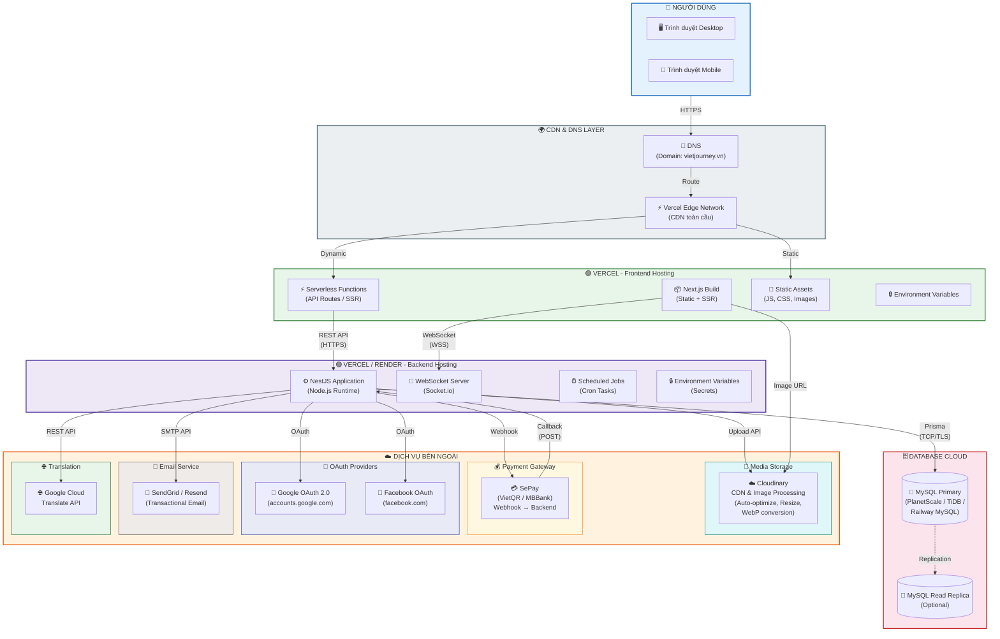
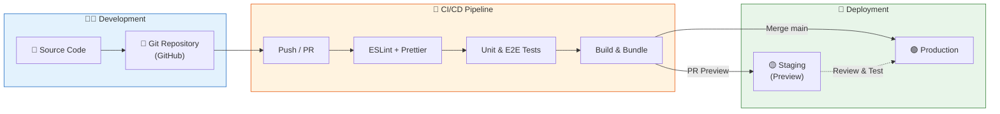
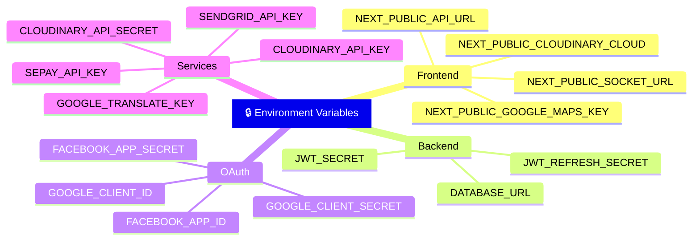

# 🚀 Sơ đồ Triển khai (Deployment Diagram) - VietJourney / MoodTravel

> **Mô tả:** Sơ đồ triển khai hệ thống VietJourney trên các nền tảng đám mây, thể hiện cách các thành phần được deploy và kết nối với nhau trong môi trường production.

---

## Sơ đồ triển khai tổng thể

---

## Sơ đồ luồng CI/CD

---

## Chi tiết hạ tầng triển khai

### 🟢 Frontend (Vercel)

| Thuộc tính | Chi tiết |
|-----------|---------|
| **Platform** | Vercel |
| **Framework** | Next.js (React 19) |
| **Build** | `next build` → Static + SSR |
| **CDN** | Vercel Edge Network (toàn cầu) |
| **Domain** | vietjourney.vn |
| **SSL** | Tự động (Let's Encrypt) |
| **Preview** | Tự động cho mỗi PR |

### 🟣 Backend (Vercel / Render)

| Thuộc tính | Chi tiết |
|-----------|---------|
| **Platform** | Vercel Serverless / Render |
| **Framework** | NestJS (Node.js) |
| **WebSocket** | Socket.io (Render Web Service) |
| **Cron Jobs** | Scheduled tasks (auto-cancel booking) |
| **Auto-scale** | Dựa trên traffic |
| **Health Check** | `/api/health` endpoint |

### 🗄️ Database (MySQL Cloud)

| Thuộc tính | Chi tiết |
|-----------|---------|
| **Provider** | PlanetScale / TiDB / Railway |
| **Engine** | MySQL 8.0+ |
| **ORM** | Prisma (migrations, seeding) |
| **Backup** | Tự động hàng ngày |
| **Connection** | TLS encrypted |

### ☁️ Cloudinary (Media CDN)

| Thuộc tính | Chi tiết |
|-----------|---------|
| **Loại file** | Ảnh homestay, phòng, tour, avatar, review |
| **Xử lý** | Auto-resize, WebP, lazy-load |
| **CDN** | Phân phối toàn cầu |
| **Giới hạn** | Tùy plan (Free: 25GB) |

### 💳 SePay (Payment)

| Thuộc tính | Chi tiết |
|-----------|---------|
| **Phương thức** | VietQR (Chuyển khoản ngân hàng) |
| **Ngân hàng** | MBBank |
| **Webhook** | POST callback khi nhận tiền |
| **Bảo mật** | Signature verification |

---

## Biến môi trường chính

