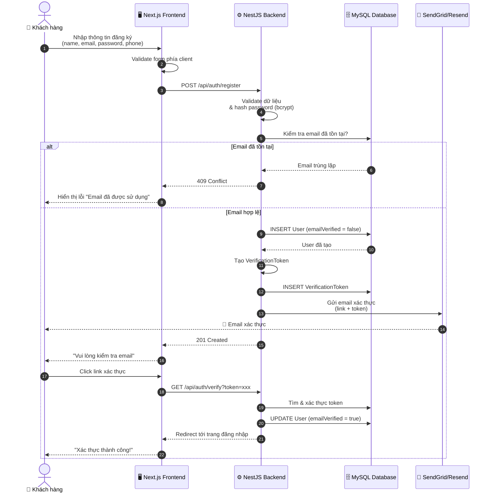
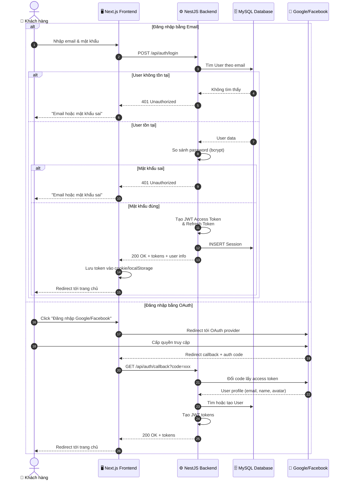
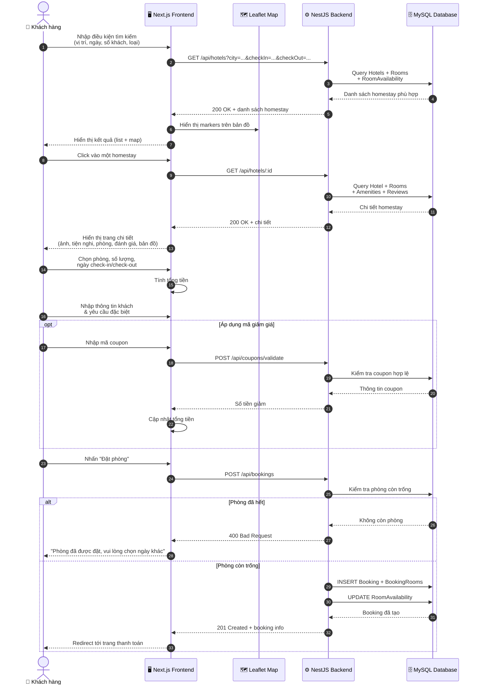
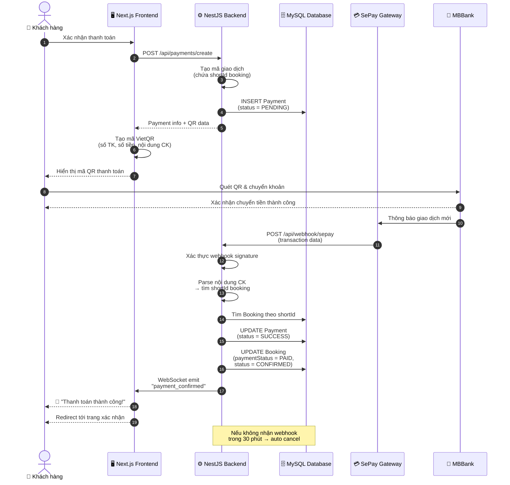
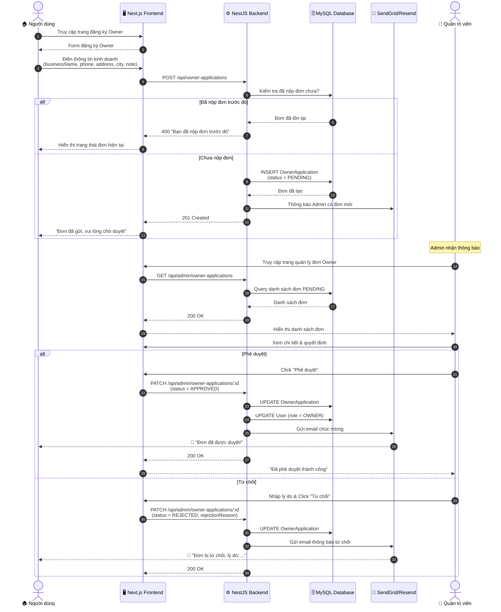
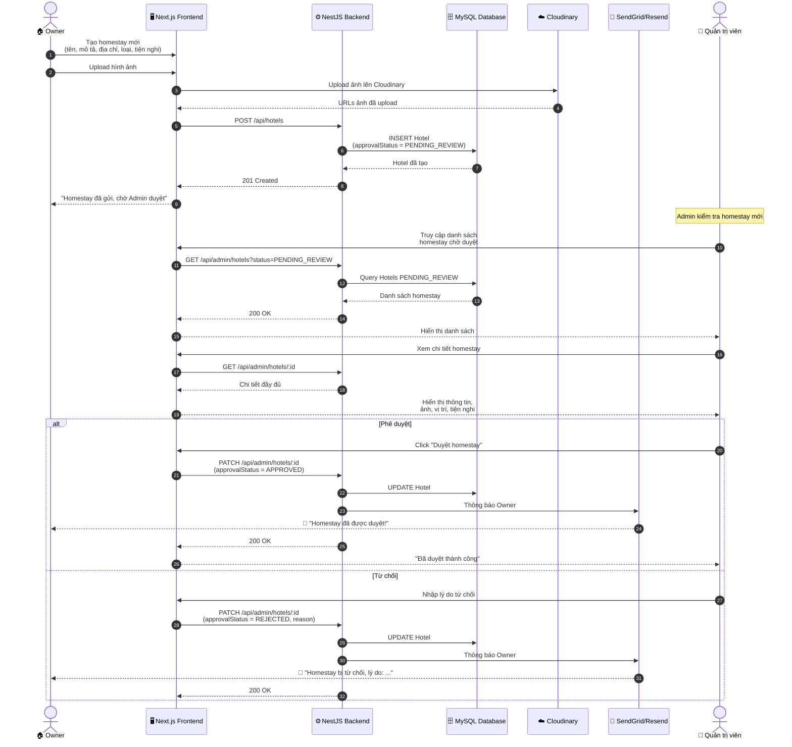
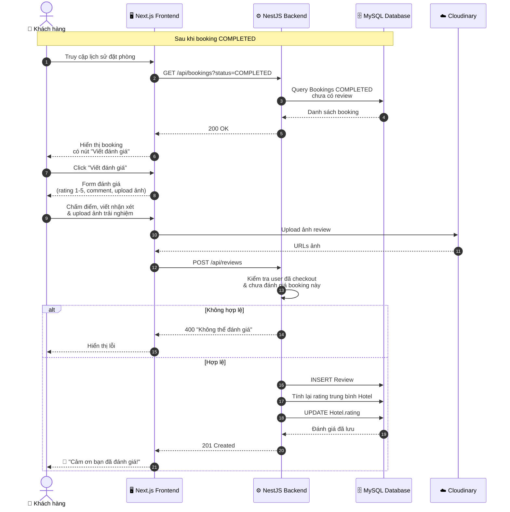
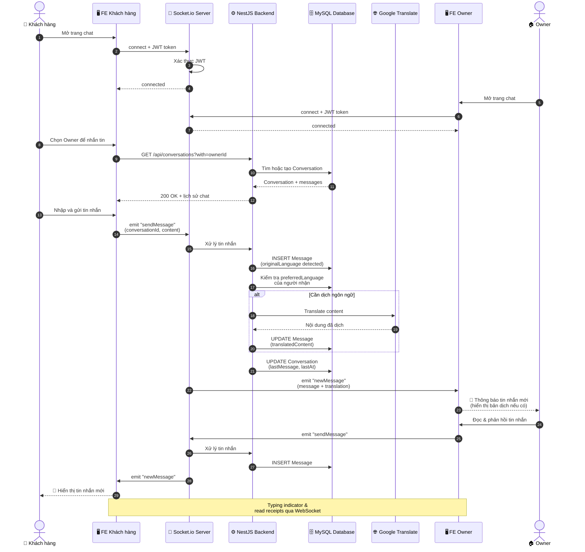
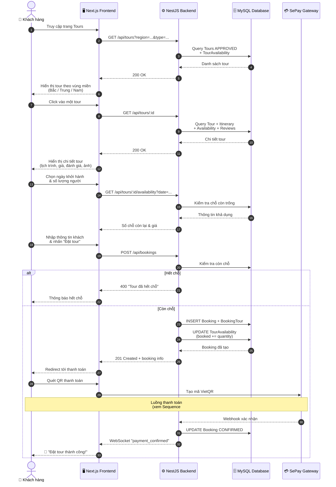

# 🔄 Sơ đồ Tuần tự (Sequence Diagrams) - VietJourney / MoodTravel

> **Mô tả:** Tập hợp các sơ đồ tuần tự mô tả luồng hoạt động chính của hệ thống đặt phòng homestay và tour du lịch VietJourney.

---

## 1. Đăng ký tài khoản (Registration with Email Verification)

---

## 2. Đăng nhập (Login with JWT)

---

## 3. Tìm kiếm và đặt phòng Homestay (Search & Book)

---

## 4. Thanh toán qua SePay/VietQR (Payment with Webhook)

---

## 5. Đăng ký làm chủ Homestay (Owner Application & Approval)

---

## 6. Quản trị viên duyệt Homestay (Admin Approve Hotel)

---

## 7. Đánh giá sau khi Checkout (Post-stay Review)

---

## 8. Nhắn tin Realtime (Real-time Chat with Translation)

---

## 9. Đặt Tour trải nghiệm (Book Experience Tour)

