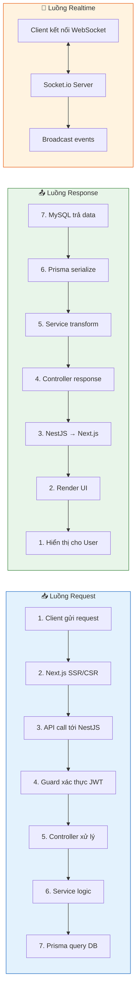

# 🏗️ Sơ đồ Kiến trúc Hệ thống - VietJourney / MoodTravel

> **Mô tả:** Sơ đồ kiến trúc tổng thể của hệ thống VietJourney, thể hiện các thành phần chính, luồng dữ liệu và tích hợp với dịch vụ bên ngoài.

---

## Kiến trúc tổng thể

```mermaid
graph TB
    %% ===== CLIENT LAYER =====
    subgraph CLIENT["🖥️ CLIENT LAYER"]
        direction LR
        BROWSER["🌐 Trình duyệt Web"]
        MOBILE["📱 Trình duyệt Mobile"]
    end

    %% ===== FRONTEND =====
    subgraph FRONTEND["⚛️ FRONTEND - Next.js (React 19)"]
        direction TB
        SSR["Server-Side Rendering<br/>(SSR / SSG)"]
        PAGES["Pages & Routing"]
        STATE["State Management"]
        subgraph FE_LIBS["Thư viện Frontend"]
            LEAFLET["🗺️ Leaflet Maps"]
            SOCKETC["🔌 Socket.io Client"]
            LUCIDE["✨ Lucide Icons"]
        end
    end

    %% ===== API GATEWAY =====
    subgraph BACKEND["⚙️ BACKEND - NestJS API Server"]
        direction TB
        subgraph MODULES["Modules"]
            AUTH_MOD["🔐 Auth Module<br/>(JWT + Passport)"]
            HOTEL_MOD["🏨 Hotel Module"]
            ROOM_MOD["🛏️ Room Module"]
            BOOK_MOD["📋 Booking Module"]
            TOUR_MOD["🏔️ Tour Module"]
            PAY_MOD["💳 Payment Module"]
            REVIEW_MOD["⭐ Review Module"]
            CHAT_MOD["💬 Chat Module"]
            USER_MOD["👤 User Module"]
            ADMIN_MOD["🔧 Admin Module"]
            COUPON_MOD["🎫 Coupon Module"]
        end

        subgraph INFRA["Infrastructure"]
            PRISMA["📦 Prisma ORM"]
            WS_SERVER["🔌 Socket.io Server<br/>(WebSocket)"]
            GUARD["🛡️ Guards & Middleware<br/>(JWT, Roles, Throttle)"]
            UPLOAD["📤 Upload Service"]
        end
    end

    %% ===== DATABASE =====
    subgraph DATABASE["🗄️ DATABASE LAYER"]
        MYSQL[("🐬 MySQL Database<br/>(Prisma Schema)")]
    end

    %% ===== EXTERNAL SERVICES =====
    subgraph EXTERNAL["☁️ DỊCH VỤ BÊN NGOÀI"]
        direction TB
        subgraph AUTH_EXT["Xác thực OAuth"]
            GOOGLE_AUTH["🔑 Google OAuth 2.0"]
            FB_AUTH["🔑 Facebook OAuth"]
        end
        subgraph MEDIA["Media & Storage"]
            CLOUDINARY["☁️ Cloudinary<br/>(Hình ảnh & Video)"]
        end
        subgraph PAYMENT["Thanh toán"]
            SEPAY["💳 SePay Gateway<br/>(VietQR / MBBank)"]
        end
        subgraph COMM["Giao tiếp"]
            SENDGRID["📧 SendGrid / Resend<br/>(Email Service)"]
        end
        subgraph TRANSLATE["Dịch thuật"]
            GG_TRANSLATE["🌐 Google Cloud<br/>Translate API"]
        end
    end

    %% ===== CONNECTIONS =====
    CLIENT -->|"HTTPS"| FRONTEND
    FRONTEND -->|"REST API<br/>(HTTPS)"| BACKEND
    FRONTEND <-->|"WebSocket<br/>(Socket.io)"| WS_SERVER

    %% Backend internal
    MODULES --> PRISMA
    PRISMA -->|"TCP/SQL"| MYSQL
    CHAT_MOD --> WS_SERVER
    AUTH_MOD --> GUARD

    %% External integrations
    AUTH_MOD -->|"OAuth 2.0"| GOOGLE_AUTH
    AUTH_MOD -->|"OAuth 2.0"| FB_AUTH
    UPLOAD -->|"API Upload"| CLOUDINARY
    PAY_MOD -->|"API / Webhook"| SEPAY
    CHAT_MOD -->|"Translation API"| GG_TRANSLATE
    AUTH_MOD -->|"SMTP API"| SENDGRID
    BOOK_MOD -->|"Email thông báo"| SENDGRID
    ADMIN_MOD -->|"Email thông báo"| SENDGRID

    %% ===== STYLING =====
    style CLIENT fill:#E3F2FD,stroke:#1565C0,stroke-width:2px
    style FRONTEND fill:#E8F5E9,stroke:#2E7D32,stroke-width:2px
    style BACKEND fill:#FFF3E0,stroke:#E65100,stroke-width:2px
    style DATABASE fill:#FCE4EC,stroke:#C62828,stroke-width:2px
    style EXTERNAL fill:#F3E5F5,stroke:#6A1B9A,stroke-width:2px
    style AUTH_EXT fill:#E8EAF6,stroke:#283593
    style MEDIA fill:#E0F7FA,stroke:#00695C
    style PAYMENT fill:#FFF8E1,stroke:#F57F17
    style COMM fill:#EFEBE9,stroke:#4E342E
    style TRANSLATE fill:#E8F5E9,stroke:#1B5E20
```

---

## Luồng dữ liệu chính

---

## Chi tiết các thành phần

| Thành phần | Công nghệ | Mô tả |
|-----------|-----------|-------|
| **Frontend** | Next.js (React 19) | SSR/SSG, App Router, responsive UI |
| **UI Components** | Lucide Icons | Icon library nhẹ, đẹp |
| **Bản đồ** | Leaflet.js | Hiển thị vị trí homestay trên bản đồ |
| **Realtime Client** | Socket.io-client | Chat realtime, thông báo |
| **Backend** | NestJS | Framework Node.js modular, TypeScript |
| **ORM** | Prisma | Type-safe database client |
| **Database** | MySQL | Cơ sở dữ liệu quan hệ |
| **Auth** | JWT + Passport | Xác thực & phân quyền |
| **OAuth** | Google, Facebook | Đăng nhập bên thứ 3 |
| **Upload** | Cloudinary | Lưu trữ & tối ưu hình ảnh |
| **Payment** | SePay (VietQR) | Thanh toán chuyển khoản QR |
| **Email** | SendGrid / Resend | Gửi email xác thực, thông báo |
| **Translation** | Google Cloud Translate | Dịch tin nhắn chat đa ngôn ngữ |
| **WebSocket** | Socket.io | Chat realtime, payment notification |
