# 📋 Sơ đồ Use Case - VietJourney / MoodTravel

> **Mô tả:** Sơ đồ ca sử dụng tổng thể của hệ thống đặt phòng homestay và trải nghiệm du lịch địa phương VietJourney.
> Hệ thống có 3 tác nhân chính: **Khách hàng (USER)**, **Chủ nhà/Owner (OWNER)**, và **Quản trị viên (ADMIN)**.

---

## Sơ đồ Use Case tổng thể

```mermaid
flowchart LR
    %% ===== TÁC NHÂN =====
    KH["🧑 Khách hàng<br/>(USER)"]
    OW["🏠 Chủ nhà<br/>(OWNER)"]
    AD["🔧 Quản trị viên<br/>(ADMIN)"]

    %% ===== HỆ THỐNG =====
    subgraph SYSTEM["🌐 Hệ thống VietJourney / MoodTravel"]
        direction TB

        subgraph AUTH["Xác thực"]
            UC1["Đăng ký tài khoản"]
            UC2["Đăng nhập<br/>(Email / Google / Facebook)"]
            UC3["Quên mật khẩu<br/>& Đặt lại mật khẩu"]
            UC4["Xác thực email"]
        end

        subgraph HOMESTAY["Homestay & Phòng"]
            UC5["Tìm kiếm homestay<br/>(theo vị trí, giá, loại)"]
            UC6["Xem chi tiết homestay"]
            UC7["Xem phòng & giá"]
            UC8["Xem trên bản đồ"]
        end

        subgraph BOOKING["Đặt phòng & Tour"]
            UC9["Đặt phòng homestay"]
            UC10["Thanh toán<br/>(SePay / VietQR)"]
            UC11["Xem lịch sử đặt phòng"]
            UC12["Hủy đặt phòng"]
            UC13["Tìm kiếm tour<br/>trải nghiệm"]
            UC14["Đặt tour trải nghiệm"]
            UC15["Áp dụng mã giảm giá"]
        end

        subgraph SOCIAL["Tương tác & Xã hội"]
            UC16["Đánh giá & Nhận xét"]
            UC17["Quản lý Wishlist"]
            UC18["Nhắn tin realtime"]
            UC19["Xem blog / bài viết"]
        end

        subgraph OWNER_MGMT["Quản lý Owner"]
            UC20["Đăng ký làm Owner"]
            UC21["Quản lý homestay"]
            UC22["Quản lý phòng<br/>& lịch trống"]
            UC23["Quản lý tour"]
            UC24["Xem đơn đặt<br/>của khách"]
            UC25["Thống kê doanh thu"]
            UC26["Cập nhật chính sách"]
        end

        subgraph ADMIN_MGMT["Quản trị hệ thống"]
            UC27["Quản lý người dùng"]
            UC28["Duyệt homestay"]
            UC29["Duyệt tour"]
            UC30["Duyệt đơn<br/>đăng ký Owner"]
            UC31["Quản lý đơn đặt<br/>toàn hệ thống"]
            UC32["Quản lý đánh giá"]
            UC33["Thống kê hệ thống"]
            UC34["Quản lý mã giảm giá"]
        end
    end

    %% ===== KHÁCH HÀNG =====
    KH --- UC1
    KH --- UC2
    KH --- UC3
    KH --- UC4
    KH --- UC5
    KH --- UC6
    KH --- UC7
    KH --- UC8
    KH --- UC9
    KH --- UC10
    KH --- UC11
    KH --- UC12
    KH --- UC13
    KH --- UC14
    KH --- UC15
    KH --- UC16
    KH --- UC17
    KH --- UC18
    KH --- UC19

    %% ===== OWNER =====
    OW --- UC2
    OW --- UC20
    OW --- UC21
    OW --- UC22
    OW --- UC23
    OW --- UC24
    OW --- UC25
    OW --- UC26
    OW --- UC18

    %% ===== ADMIN =====
    AD --- UC2
    AD --- UC27
    AD --- UC28
    AD --- UC29
    AD --- UC30
    AD --- UC31
    AD --- UC32
    AD --- UC33
    AD --- UC34

    %% ===== STYLING =====
    style KH fill:#4CAF50,stroke:#2E7D32,color:#fff
    style OW fill:#FF9800,stroke:#E65100,color:#fff
    style AD fill:#F44336,stroke:#B71C1C,color:#fff
    style SYSTEM fill:#E3F2FD,stroke:#1565C0
    style AUTH fill:#FFF3E0,stroke:#FF9800
    style HOMESTAY fill:#E8F5E9,stroke:#4CAF50
    style BOOKING fill:#FCE4EC,stroke:#E91E63
    style SOCIAL fill:#F3E5F5,stroke:#9C27B0
    style OWNER_MGMT fill:#FFF8E1,stroke:#FFC107
    style ADMIN_MGMT fill:#FFEBEE,stroke:#F44336
```

---

## Chi tiết các Use Case theo tác nhân

### 👤 Khách hàng (USER)
| STT | Use Case | Mô tả |
|-----|----------|-------|
| UC1 | Đăng ký tài khoản | Đăng ký bằng email hoặc OAuth (Google/Facebook) |
| UC2 | Đăng nhập | Đăng nhập bằng email/mật khẩu hoặc OAuth |
| UC3 | Quên & đặt lại mật khẩu | Gửi email reset password |
| UC4 | Xác thực email | Xác minh tài khoản qua email |
| UC5 | Tìm kiếm homestay | Tìm theo vị trí, giá, loại hình, tiện nghi |
| UC6 | Xem chi tiết homestay | Xem thông tin, hình ảnh, đánh giá, vị trí |
| UC7 | Xem phòng & giá | Xem danh sách phòng, giá theo ngày |
| UC8 | Xem trên bản đồ | Xem vị trí homestay trên Leaflet map |
| UC9 | Đặt phòng homestay | Chọn phòng, ngày, và tiến hành đặt |
| UC10 | Thanh toán | Thanh toán qua SePay/VietQR |
| UC11 | Xem lịch sử đặt phòng | Xem các đơn đặt đã tạo |
| UC12 | Hủy đặt phòng | Hủy đơn đặt (theo chính sách) |
| UC13 | Tìm kiếm tour | Tìm tour theo vùng miền, loại hình |
| UC14 | Đặt tour trải nghiệm | Đặt tour với ngày và số lượng |
| UC15 | Áp dụng mã giảm giá | Sử dụng coupon khi thanh toán |
| UC16 | Đánh giá & nhận xét | Đánh giá homestay/tour sau khi hoàn thành |
| UC17 | Quản lý Wishlist | Lưu/xóa homestay, tour yêu thích |
| UC18 | Nhắn tin realtime | Chat trực tiếp với Owner |
| UC19 | Xem blog | Đọc bài viết du lịch |

### 🏠 Chủ nhà (OWNER)
| STT | Use Case | Mô tả |
|-----|----------|-------|
| UC20 | Đăng ký làm Owner | Gửi đơn đăng ký với thông tin kinh doanh |
| UC21 | Quản lý homestay | Thêm, sửa, xóa homestay |
| UC22 | Quản lý phòng & lịch trống | CRUD phòng, cập nhật giá/lịch |
| UC23 | Quản lý tour | Thêm, sửa, xóa tour trải nghiệm |
| UC24 | Xem đơn đặt của khách | Xem và quản lý booking |
| UC25 | Thống kê doanh thu | Xem báo cáo doanh thu |
| UC26 | Cập nhật chính sách | Cập nhật chính sách hủy, check-in |

### 🔧 Quản trị viên (ADMIN)
| STT | Use Case | Mô tả |
|-----|----------|-------|
| UC27 | Quản lý người dùng | Xem, khóa, phân quyền user |
| UC28 | Duyệt homestay | Duyệt/từ chối homestay mới |
| UC29 | Duyệt tour | Duyệt/từ chối tour mới |
| UC30 | Duyệt đơn Owner | Phê duyệt đơn đăng ký Owner |
| UC31 | Quản lý đơn đặt | Xem tất cả booking hệ thống |
| UC32 | Quản lý đánh giá | Kiểm duyệt, xóa đánh giá |
| UC33 | Thống kê hệ thống | Dashboard tổng quan hệ thống |
| UC34 | Quản lý mã giảm giá | CRUD coupon/mã khuyến mãi |
